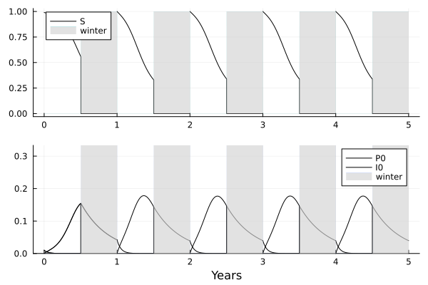

# SeasonalEpid

[](https://Dylan-Cmt.github.io/SeasonalEpid/dev/)

This is a package to do seasonal plant epidemic simulations.

It is distributed under the CeCILL-C license. Please refer to the LICENSE file for more details.

## Installation

From the Julia REPL, enter in the Pkg mode with ``` ] ``` and then enter

```jl
add https://github.com/Dylan-Cmt/SeasonalEpid
```

And that's it, now you can now use the package.

## Replicating an example



In order to replicate this run, you can simply execute the following code.

```
using SeasonalEpid
sp = StateElaborate()
param = ParamAirborneElaborate1Strain()
tp = TimeParam()
displaysim(5, sp, param, tp=tp)
```
