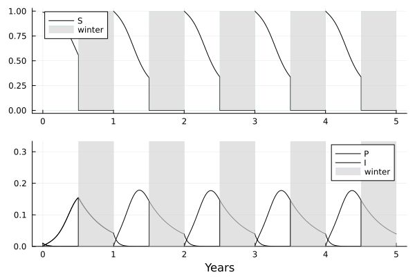
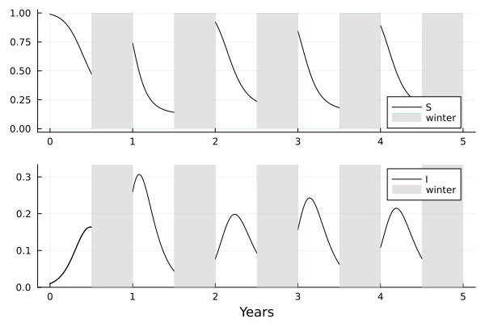

# A SeasonalEpid tutorial

```@contents
Pages = ["tutorial.md"]
Depth = 4
```

`SeasonalEpid` allows the user to play with epidemics models through modeling and simulations. It is based on the Madden and
van den Bosch ([2002](https://doi.org/10.1641/0006-3568(2002)052[0065:APDATA]2.0.CO;2))'s model and an article by Ludovic Mailleret,Magda Castel, Josselin Montarry and Frédéric M. Hamelin ([2011](https://link.springer.com/article/10.1007/s12080-011-0126-0)). Here is an airborne elaborate model formed by four systems (but you can try with its soilborn compact version, the other model which is implemented):

$$\begin{align}
&\begin{aligned}
    &\left\{ \begin{array}{l}
        \dot{P} = - \Lambda P \\
        \dot{S} = - \Theta P S - \beta S I \\
        \dot{I} = + \Theta P S + \beta S I - \alpha I
    \end{array} \right.
\end{aligned}
&&\begin{aligned}
    &\left\{ \begin{array}{l}
        P(k T+\tau^{+}) = P(k T+\tau)+\pi I(k T+\tau) \\
        S(k T+\tau^{+}) = 0 \\
        I(k T+\tau^{+}) = 0
    \end{array} \right.
\end{aligned} \\
&\begin{aligned}
    &\left\{ \begin{array}{l}
        \dot{P} = - \mu P \\
        \dot{S} = 0 \\
        \dot{I} = 0
    \end{array} \right.
\end{aligned}
&&\begin{aligned}
    &\left\{ \begin{array}{l}
        P((k + 1)T^{+}) = P((k + 1)T) \\
        S((k + 1)T^{+}) = S_0 \\
        I((k + 1)T^{+}) = 0
    \end{array} \right.
\end{aligned}
\end{align}$$

Top left system represents the growing season equations, top right system represents recurrence equation for initial condition when the winter season is starting, bottom left system represents the winter season equations and bottom right system represents recurrence equation for initial condition when the growing season is starting.

Here is a summary of the notations:

$$\begin{array}{|l|l|}
\hline 
\text{ Label } & \text { Meaning } \\
\hline 
P & \text { Primary inoculum density } \\
S & \text { Susceptible host plant density } \\
I & \text { Infected host plant density } \\
\tau & \text { Growing season length (host plant is present) } \\
T - \tau & \text { Winter season length (host plant is absent) } \\
T & \text { Year length } \\
\beta & \text { Secondary infection rate } \\
\Theta & \text { Primary infection rate } \\
\alpha & \text { Infected host plants removal rate } \\
\pi & \text { Conversion rate from I to P (at the end of the season) } \\
\mu & \text { Winter season mortality rate of primary inoculum } \\
\Lambda & \text {Primary inoculum density independent depletion rate } \\
\Xi & \text { Primary inoculum density dependent depletion rate } \\
\hline
\end{array}$$

## Replicating an example



In order to replicate this run, you can simply execute the following code.

```
using SeasonalEpid
sp = StateElaborate()
param = ParamAirborneElaborate1Strain()
tp = TimeParam()
displaysim(5, sp, param, tp=tp)
```

## Modifying parameters of the model

If you want to change parameters, just fill arguments you want to modify in the adapted type.
If you modify the number of states (like to simulate a compact model instead of an elaborate model), please make sur that you also modify types that depends on it.

For example, now we want to implement a soilborne compact model with a low conversion rate from I to P (denoted $\Pi$). Here is the result:



And the code to get it:

```
using SeasonalEpid
sp = StateCompact()
param = ParamSoilborneCompact1Strain(Π=0.5)
tp = TimeParam()
displaysim(5, sp, param, tp=tp)
```